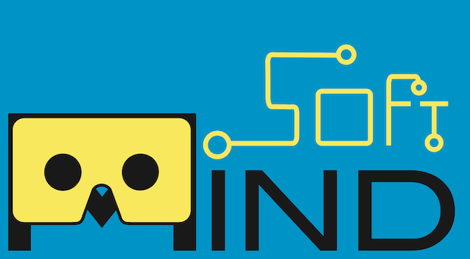

# MindAR-101

En este proyecto se siguen los ejemplos básicos y tutoriales proporcionados por la página de MindAR. No pretende presentar algo nuevo, sino mas bien servir de notas personales.

- Existen 4 distribuciones de acuerdo al tipo seguimiento que se desea realizar (caras o imágenes) o la biblioteca para la gestión de objetos en 3d (Three.js o AFRAME).

En mi caso estoy interesando en el seguimiento de imágenes y usarlo en conjunto con AFRAME.

Para realizar una aplicación de imágenes es necesario:

1. Compilar la imagen, con el fin de que el sistema encuentre zonas de interés útiles para el seguimiento (_feature points_).

Existen algunas heuristicas que pueden ser útiles a la hora de escoger una buena imagen para seguimiento en aplicaciones de AR.

Los puntos de características son un conjunto de pixeles de alto interés de una imagen y que usa el algoritmo de seguimiento para determinar la ubicación espacial de la imagen. Estos puntos de características deben ser únicos: no se pueden confundir con otras zonas de la imagen, incluso cuando esta se vea sometida a ciertas transformaciones (como un cambio de orientación). La facilidad de identificación como la unicidad del punto son propiedades de un punto de características.

Una imagen de seguimiento debe tener, por lo tanto:

- Buenos puntos de características que sean distinguibles entre si.
- Una cantidad razonable de puntos de características, que permitan identificar la imagen como una unidad.
- Los puntos de características deben estar distribuidos uniformemente, para que la tarea de seguimiento tolere mejor los errores.

Esto se traduce a:

- Prefiera imágenes complejas frente a las simples.
- Evite usar imágenes con patrones simétricos o repetitivos.
- Imágenes con un porcentaje grande espacios en blanco o de color solido (sin textura).
- Previera las imágenes con alto contraste.

Características irrelevantes:

- Colores.
- Gradientes de color.

Teniendo estás consideraciones se puede elegir una imagen y compilarla usando la herramienta que provee MindAR:

https://hiukim.github.io/mind-ar-js-doc/quick-start/compile

En mi caso he decidido usar la siguiente:

Es importante recordar que MindAR se enfoca unicamente en el seguimiento y actualizar la posición de una entidad en 3d.
Recibe como entrada las imágenes capturadas por la cámara del dispositivo en el cual se esta ejecutando y a partir de esta, detecta y sigue la imagen de seguimiento configurada y actualiza la visibilidad y posición de la entidad 3d.

Modelo usado: https://sketchfab.com/3d-models/clock-7617bf448dc44e88af45e6b268745659
descargado de [Sketchfab](https://sketchfab.com/)

:bulb: Interactuar con el SmartWatch Bangle.js 2

## Fuentes

- https://hiukim.github.io/mind-ar-js-doc/quick-start/compile
- https://blog.pictarize.com/how-to-choose-a-good-target-image-for-tracking-in-ar-part-1/
